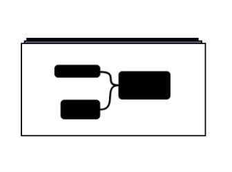
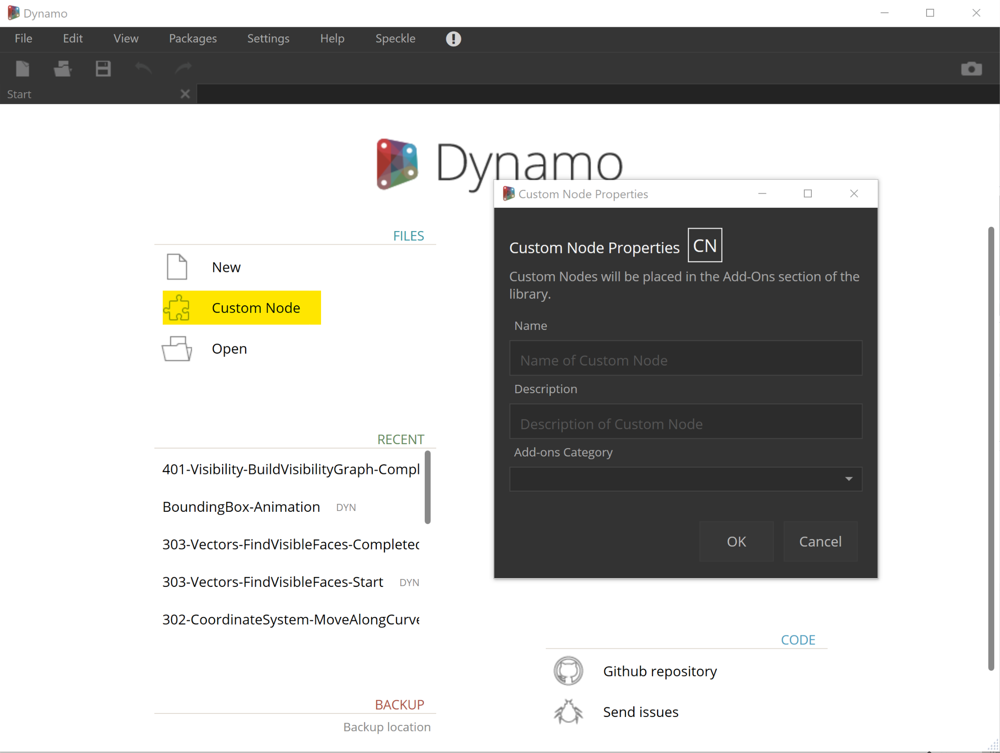
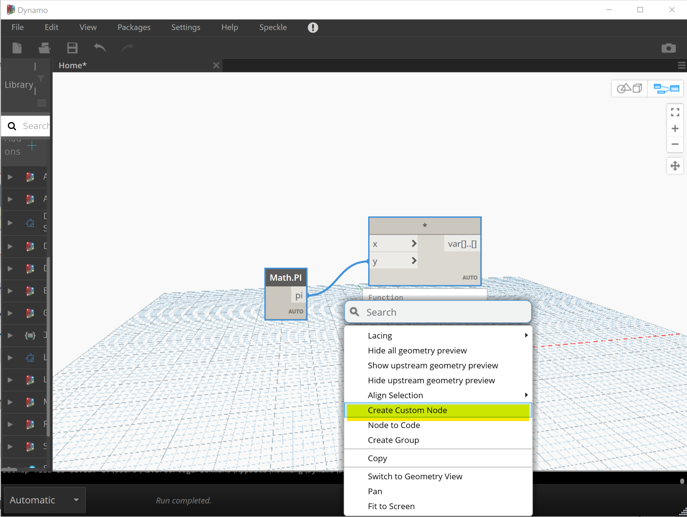
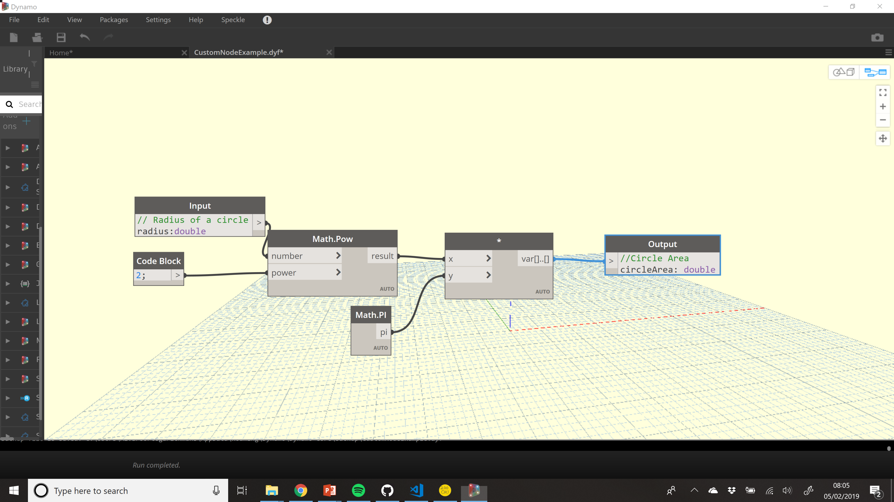

# 1 - Custom Nested Nodes <!-- omit in toc --> 

This is easiest method to create custom functionality in Dynamo that can be shared as a package.

A **Custom Nested Node** (CNN) is nothing more than grouped *OOTB* (out of the box) nodes or even nodes from other packages.

These **CNN** are saved as files with **.dyf** extension.

- [Create](#create)
  - [From Scratch](#from-scratch)
  - [From Existing Nodes](#from-existing-nodes)
- [Input and Output](#input-and-output)
- [Key Features](#key-features)
- [Disadvantages](#disadvantages)

## Create

A CNN can be created in two ways. When creating/modifying a CNN, the background canvas its coloured in yellow.

### From Scratch

From the initial Dynamo window, you can create a new CNN by selecting `Custom Node` and defining its properties.

### From Existing Nodes
By selecting a set of nodes in a normal dynamo graph environment, you can right-click and select **Create Custom Node**. The same popup will appear to fill the node's properties.

## Input and Output
One key benefit of **Custom Nested Nodes** is the ability to specify as many input and output ports as desired.

This is achieved by adding the `Input` and `Output` components, only available when editing a CNN (yellow background).

## Key Features
- Specify the type of object expected on each particular input/output port.
- Define default values to use when no wire is connected to the input port.
- Add descriptions as comments (double forward-slash `//`) to be exposed when hovering over the ports.
- They can contain any other node type, like python scripts, code blocks, ZT nodes, etc.
- Replication principles can be applied.

## Disadvantages
- For large logics, the computational overhead will be the same as they are still using Nodes.
- Difficult to debug.
- When sharing a graph using a CNN, this **MUST** be shared as well, as otherwise the graph will fail.