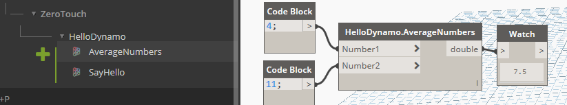

# 3.3 - Dynamo Node Development<!-- omit in toc --> 

In this part we will develop a few sample nodes exploring inputs, outputs, Dynamo's geometry and handling error/exceptions. Since we wont't be interacting with Revit just yet, development will target Dynamo Sandbox. Let’s dive straight in and see how to add more complex functionalities to our package.

- [Input & Output (I/O)](#input--output-io)
- [Inputs](#inputs)
- [Outputs](#outputs)
- [Dynamo Geometry](#dynamo-geometry)
- [Exceptions](#exceptions)

## Input & Output (I/O)

Most of your nodes will :
- take one or more inputs
- do something with them
- and then return one or more outputs.

Let's look at each of those in a bit more detail. 

## Inputs

The first example is what we did in the previous exercise, a simple function that has 1 input text and returns a modified version of it :
```csharp
public static string SayHello(string Name)
    {
      return "Hello " + Name + "!";
    }
```

To accept multiple inputs, simply add more input parameters to your functions.
```csharp
public static double AverageNumbers(double Number1, double Number2)
{
  return (Number1 + Number2) / 2;
}
```



As you can clearly understand, the above will only accepts the declared input types, to accept any type you can use the `object` type. For lists/arrays, again, just follow normal C# conventions.

What if your input is not one, or two values, but an entire list ?
Let's see an example that handles a list as an input and returns that same list but without any of its contents :
```csharp
public static IList ClearListContents(IList list)
{
  list.Clear();
  return list;
}
```

And then what happens if you don't know in advance the structure of the incoming data? What if you want to handle inputs with variable nesting and single items as well? Use the `[ArbitraryDimensionArrayImport]` attribute & make sure you  have the `using Autodesk.DesignScript.Runtime;` directive in your file:

```csharp
public static IList AddItemToEnd([ArbitraryDimensionArrayImport] object item, IList list)
{
    return new ArrayList(list) //Clone original list
    {
        item //Add item to the end of cloned list.
    };
}
```
## Outputs

Returning multiple values is a little bit more tricky :
- first you need the `using Autodesk.DesignScript.Runtime;` directive
- then we need to add a `MultiReturn` attribute to the function
- and finally create a dictionary to store our outputs

Our first example that illustrates this is a function that takes in a list of integers and splits them into two distinct lists, each containing only odd or even numbers.

```csharp
[MultiReturn(new[] { "evens", "odds" })]
public static Dictionary<string, object> SplitOddEven(List<int> list)
{
  var odds = new List<int>();
  var evens = new List<int>();

  //check integers in list if even or odd
  foreach (var i in list)
  {
    if (i % 2 == 0)
    {
      evens.Add(i);
    }
    else
    {
      odds.Add(i);
    }
  }

  //create a new dictionary and return it
  var d = new Dictionary<string, object>();
  d.Add("evens", evens);
  d.Add("odds", odds);
  return d;

  //the above can be simplified in one line with
  //return new Dictionary<string, object> { { "evens", evens }, { "odds", odds } };       
}
```


## Dynamo Geometry

To access native Dynamo geometry and methods, you just need to add the `using Autodesk.DesignScript.Geometry;` directive, we can now read element's properties.

The example below deconstructs a point into its X,Y & Z coordinates
```csharp
[MultiReturn(new[] { "X", "Y", "Z" })]
public static Dictionary<string, object> DeconstructPoint(Point point)
{
  return new Dictionary<string, object> { 
    { "X", point.X }, 
    { "Y", point.Y }, 
    { "Z", point.Z } 
  };
}
```

And this one generates Dynamo geometry, creating a line from two X,Y,Z coordinates pairs.

```csharp
public static Line LineByCoordinatesPair(double X1, double Y1, double Z1, double X2, double Y2, double Z2)
{
  var p1 = Point.ByCoordinates(X1, Y1, Z1);
  var p2 = Point.ByCoordinates(X2, Y2, Z2);

  return Line.ByStartPointEndPoint(p1, p2);
}
```
But **BE CAREFUL!** Each geometry object that you create in your functions will use Dynamo resources, therefore if it's not needed or returned by your methods it should be disposed, either like this:

```csharp
public static Line LineByCoordinatesPair(double X1, double Y1, double Z1, double X2, double Y2, double Z2)
{
  var p1 = Point.ByCoordinates(X1, Y1, Z1);
  var p2 = Point.ByCoordinates(X2, Y2, Z2);
  var l = Line.ByStartPointEndPoint(p1, p2);
  p1.Dispose();
  p2.Dispose();
  return l;
}
```
Or with a `using` statement:

```csharp
public static Line ByCoordinates(double X1, double Y1, double Z1, double X2, double Y2, double Z2)
{
  using (var p1 = Point.ByCoordinates(X1, Y1, Z1))
  {
    using (var p2 = Point.ByCoordinates(X2, Y2, Z2))
    {
      return Line.ByStartPointEndPoint(p1, p2);
    }
  }
}
```

## Exceptions

When writing any method, it's good practice to check the validity of your inputs (parameters) first and raising exceptions if anything is invalid, therefore halting executing of that method and not executing any un-necessary code.

In C#, raising an exception is as simple as :

```csharp
throw new Exception("This is the message that will accompany the exception.");
```

Doing this inside a Dynamo node is gracefully handled by Dynamo, turning the node yellow and displaying the error message. Let's see an example :

```csharp
public static string ThrowExceptionIfStringIsNull(string text)
{
    if (string.IsNullOrWhiteSpace(text)) throw new ArgumentNullException("text");
    return text;
}
```

Which will be displayed like this in Dynamo :


If we were doing something a bit more complicated, we might want to handle errors & exceptions ourselves inside our node and only surface the error to the users when it can't be ignored, or with more detailed information about it.

Here's an example that handles exceptions internally, but also surfaces them when needed. What it does is calculate the sum of all list members, but it skips over null values, which would otherwise cause an `Exception` to be thrown when trying to add them up.

```csharp
public static int HandleListNullExceptionsInternally(List<object> list)
{
    // check input list is not empty
    if (list == null || list.Count < 1) throw new ArgumentNullException("list");
    var sum = 0;

    foreach (var item in list)
    {
        try
        {
            // it's safe to throw inside a try block as the exception will be caught below
            if (item == null) throw new NullReferenceException();

            // if the object cannot be converted to an integer, this will throw an exception as well
            int intValue = Convert.ToInt32(item);

            // this only executes if the above checks did not throw
            sum += intValue;
        }
        catch (Exception)
        {
            // this block of code would be executed whenever a null is found in the list
        }
    }

    return sum;
}
```
