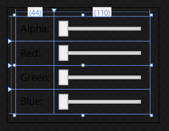
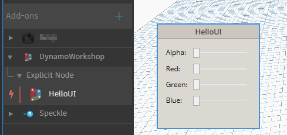

# 2 - Explicit Node Interfaces<!-- omit in toc --> 

Let's now see how to use our User Control inside a custom UI node. Open the empty project inside `2 - ExplicitNode Start`, this was set up in the same way we did in the previous lab, the only additional dependency, which can be installed via NuGet, is the WpfUILibrary:


- [The NodeModel interface](#the-nodemodel-interface)
- [The Custom UI](#the-custom-ui)
- [The INodeViewCustomization Interface](#the-inodeviewcustomization-interface)

## The NodeModel interface

Custom UI nodes implement the NodeModel **interface**, the same way native nodes do. An interface is like an abstract base class, any class that implements the interface must implement all its members. Basically you'll just have to add  `:NodeModel` after the class name, and have certain functions in your class.

Create a new class named `HelloUI.cs`, then add the interface, directives and attributes as below:

```c#
/* dynamo directives */
using Dynamo.Graph.Nodes;
using Newtonsoft.Json;
using System.Collections.Generic;

namespace DynamoWorkshop.ExplicitNode
{
  [NodeName("HelloUI")]
  [NodeDescription("Sample Explicit Node")]
  [NodeCategory("DynamoWorkshop.Explicit Node")]
  [IsDesignScriptCompatible]
  public class HelloUI : NodeModel
  {
    //Json Constructor for Dynamo 2.0 nodes
    [JsonConstructor]
    private HelloUI(IEnumerable<PortModel> inPorts, IEnumerable<PortModel> outPorts) : base(inPorts, outPorts)
    {
    }

    public HelloUI()
    {

    }
  }
}

```

As you can see in Dynamo 2.0 there are 2 constructors:  the original parameterless constructor is used to initialize a new nodes created within Dynamo (via the library for example). The JSON constructor is required to initialize a node that is deserialized *(loaded)* from a saved .dyn or .dyf file. 

More on JSON constructors can be found here: [github.com/DynamoDS/Dynamo/wiki/Update-Packages-from-1.3-to-2.0](https://github.com/DynamoDS/Dynamo/wiki/Update-Packages-from-1.3-to-2.0#json-constructors)

In explicit nodes there is no need for a `_DynamoCustomization.xml` file, as the attributes on top of our class will define its category, name & whether it's usable in code blocks.

## The Custom UI

We have seen in the previous chapter how to create a WPF control, we'll now create a similar one that the node will use as UI.

Create a new UserControl `ColorSelector.xaml` with the code below:

```c#
<UserControl
  x:Class="DynamoWorkshop.ExplicitNode.ColorSelector"
  xmlns="http://schemas.microsoft.com/winfx/2006/xaml/presentation"
  xmlns:x="http://schemas.microsoft.com/winfx/2006/xaml"
  xmlns:d="http://schemas.microsoft.com/expression/blend/2008"
  xmlns:local="clr-namespace:DynamoWorkshop.ExplicitNode"
  xmlns:mc="http://schemas.openxmlformats.org/markup-compatibility/2006"
  mc:Ignorable="d">
  <Grid Margin="10">
    <Grid.RowDefinitions>
      <RowDefinition Height="Auto" />
      <RowDefinition Height="Auto" />
      <RowDefinition Height="Auto" />
      <RowDefinition Height="Auto" />
    </Grid.RowDefinitions>
    <Grid.ColumnDefinitions>
      <ColumnDefinition Width="Auto" />
      <ColumnDefinition Width="Auto" />
    </Grid.ColumnDefinitions>
    <Label
      Grid.Row="0"
      Grid.Column="0"
      Content="Alpha:" />
    <Label
      Grid.Row="1"
      Grid.Column="0"
      Content="Red:" />
    <Label
      Grid.Row="2"
      Grid.Column="0"
      Content="Green:" />
    <Label
      Grid.Row="3"
      Grid.Column="0"
      Content="Blue:" />
    <Slider
      Name="SliderA"
      Grid.Row="0"
      Grid.Column="1"
      Width="100"
      Margin="5"
      HorizontalAlignment="Left"
      VerticalAlignment="Top"
      IsSnapToTickEnabled="True"
      Maximum="255"
      Minimum="0"
      TickFrequency="1"
      Value="{Binding SliderValueA}" />
    <Slider
      Name="SliderR"
      Grid.Row="1"
      Grid.Column="1"
      Width="100"
      Margin="5"
      HorizontalAlignment="Left"
      VerticalAlignment="Top"
      IsSnapToTickEnabled="True"
      Maximum="255"
      Minimum="0"
      TickFrequency="1"
      Value="{Binding SliderValueR}" />
    <Slider
      Name="SliderG"
      Grid.Row="2"
      Grid.Column="1"
      Width="100"
      Margin="5"
      HorizontalAlignment="Left"
      VerticalAlignment="Top"
      IsSnapToTickEnabled="True"
      Maximum="255"
      Minimum="0"
      TickFrequency="1"
      Value="{Binding SliderValueG}" />
    <Slider
      Name="SliderB"
      Grid.Row="3"
      Grid.Column="1"
      Width="100"
      Margin="5"
      HorizontalAlignment="Left"
      VerticalAlignment="Top"
      IsSnapToTickEnabled="True"
      Maximum="255"
      Minimum="0"
      TickFrequency="1"
      Value="{Binding SliderValueB}" />
  </Grid>
</UserControl>

```

As you can see from the preview, it's just a grid with 4 sliders.



## The INodeViewCustomization Interface

Since our node has a custom UI, we need to create another class which implements the INodeViewCustomization interface. Create a new class named `HelloUINodeView.cs` and add:

```c#
/* dynamo directives */
using Dynamo.Controls;
using Dynamo.ViewModels;
using Dynamo.Wpf;

namespace DynamoWorkshop.ExplicitNode
{
  public class HelloUINodeView : INodeViewCustomization<HelloUI>
  {
    private DynamoViewModel dynamoViewModel;
    private HelloUI helloUiNode;

    public void CustomizeView(HelloUI model, NodeView nodeView)
    {
      dynamoViewModel = nodeView.ViewModel.DynamoViewModel;
      helloUiNode = model;
      var ui = new ColorSelector();
      nodeView.inputGrid.Children.Add(ui);
      ui.DataContext = model;
    }

    public void Dispose()
    {
    }
  }
}
```

The code above is very important:

- `nodeView.inputGrid.Children.Add(ui);` is adding our custom control to the node UI
- `ui.DataContext = model;` is binding our HelloUI class as view model of the custom UI
- we are not using the `dynamoViewModel` but it's really powerful as it's the view model of the entire Dynamo application

If you debug, you'll see the node with the user control embedded, behaving as before, but without any input or output port.

 If you've missed any step you can find this completed part in the folder `3 - ExplicitNode Interfaces`.




