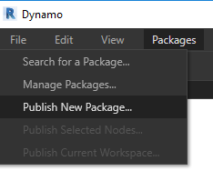
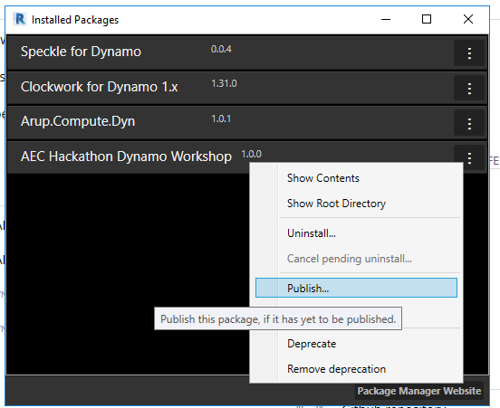

# 4.4 - Publishing to the Package Manager

Publishing a package to the package manager is a very simple process especially given how we have set up our Visual Studio projects. 

**Only publish packages that you own and that you have tested thoroughly!**

Publishing can only be done from Dynamo for Revit or Dynamo Studio, not from the Sandbox version.

Click on Packages > Manage Packages...

Next to your package, click the 3 dots and then Publish:

In the next screen make sure all the information are correct and that only the required dlls are being included (remember when we had to manually set `Copy Local` to `False` on the references?). These field can be modified in pkg.json.

As you click Publish Online it will be on the Package Manager, to upload new version use Publish Version... instead.

Note that packages **cannot be deleted or renamed**, but only deprecated.  
