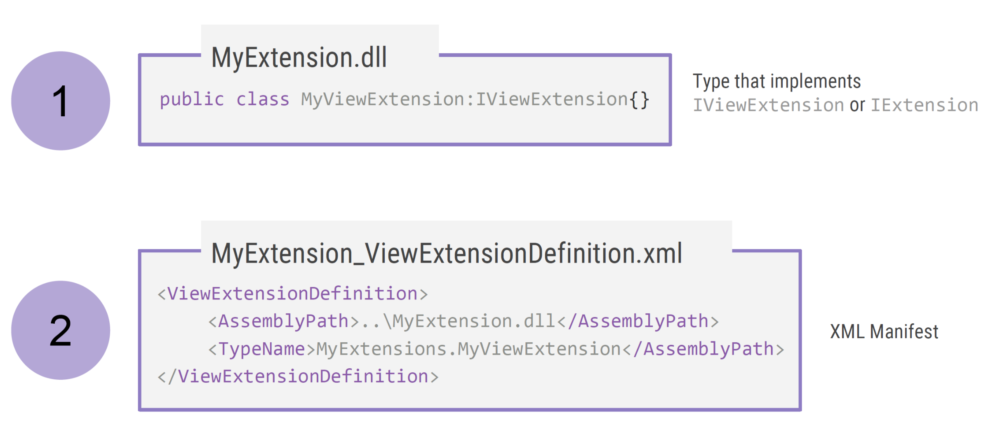
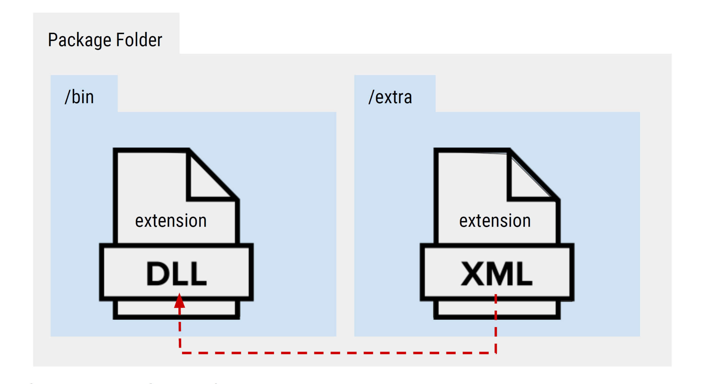
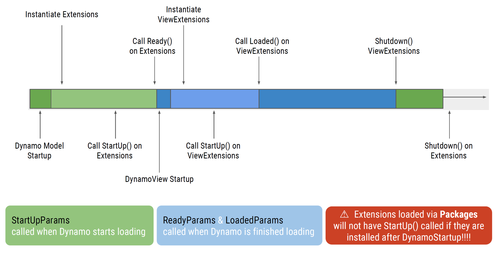
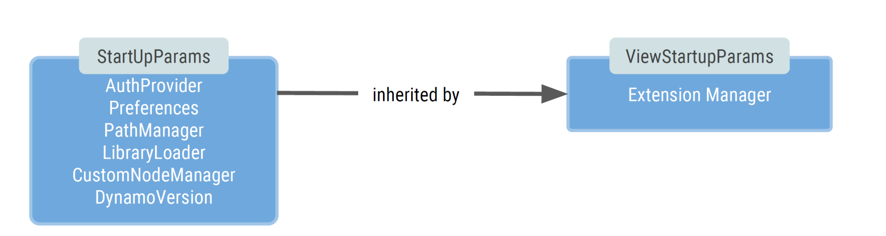
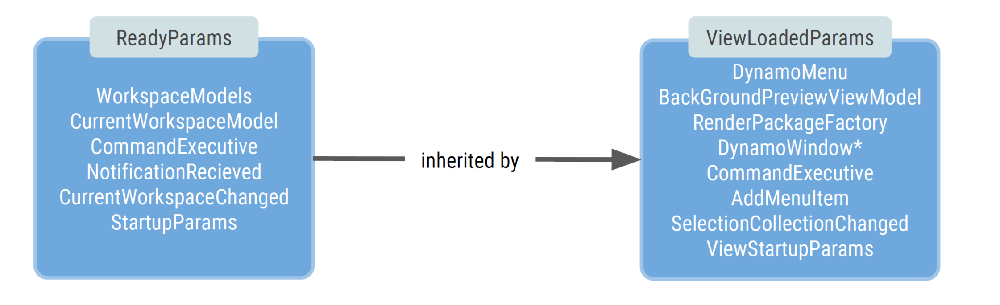

# 5.1 - Anatomy of an Extension  <!-- omit in toc --> 

Dynamo implemented Extensions and ViewExtensions in a similar fashion as ZeroTouch nodes: they handle *automagically* how a `dll` is loaded and made available to the platform as long as it complies with certain steps and configurations, so extending Dynamo is simple and fun.

- [Extension Architecture](#extension-architecture)
  - [Naming and Location](#naming-and-location)
- [Extension's Lifecycle](#extensions-lifecycle)
- [Dynamo APIs](#dynamo-apis)
  - [StartUpParams / ViewStartupParams](#startupparams--viewstartupparams)
  - [ReadyParams / ViewLoadedParams](#readyparams--viewloadedparams)
- [Extension and ViewExtension](#extension-and-viewextension)

## Extension Architecture


In order for an Extension to be loaded, Dynamo needs mainly two things (for now): 

- **DLL** library: This is the extension compiled library the contains the logic and functionality the developer wants to add to Dynamo.
- **XML** manifest: Basically, a file telling Dynamo where to get the Extension's `dll` from.


### Naming and Location
Dynamo will expect the Extensions and ViewExtensions to comply with certain naming and location standards to be able to load them automatically.

The file name of the `xml` manifest must be the name of the `dll` library, an underscore and the type of extension (`Extension` or `ViewExtension`). So for example, if the `dll` library is named `MyAwesomeExtension.dll`, its corresponding manifest must be `MyAwesomeExtension_Extension.xml` or `MyAwesomeExtension_ViewExtension.xml`, depending of the type of extension you are building.

Also, the manifest file must be located in one of the following directories:
- Dynamo Core folder, located on the installed directory on the C drive.
- As a package, on the `extra` folder.



Storing the manifest on the `extra` folder is usually a more stable way as:
- Sharing the extension will be easier as the `dll` and `manifest` will be shipped under the same *container* (i.e. a package).
- Specifying the assembly path on the manifest is easier as will always be a relative path within the package (i.e. `../bin/MyAwesomeExtension.dll`).
- Sometimes, writing to the C drive is protected and forbidden for user without admin rights, making it difficult to use an Extension.

## Extension's Lifecycle

When Dynamo is initialized it performs several actions to have things up and running properly. These actions include what in this material is called the **Extension's Lifecycle**:

- During initialization Dynamo searches for any Extension that has been declared via its `xml` manifest, calling the `StartUp()` method to initialize it and `Ready()` or `Loaded()` when the extension is successfully initialized.
- During normal execution, the extension performs any action that has been programed to do.
- Before Dynamo closes, it calls every extension's `ShutDown()` method, that should be used to properly release any resource the extension is using.


## Dynamo APIs
During extension's initialization, Dynamo calls `StartUp()` and `Ready()`/`Loaded()` methods passing particular arguments that expose some of Dynamo's APIs to be used on the extension.

### StartUpParams / ViewStartupParams
These arguments are injected to each Extension/ViewExtension on the `StartUp()` method. `ViewStartupParams` inherits from `StartUpParams`.

```csharp
// Example on a ViewExtension

public void Startup(ViewStartupParams p)
{
    // Magic happens here
}
```


### ReadyParams / ViewLoadedParams
The `ReadyParams` is passed on when calling the `Ready()` method on an Extension, while the `ViewLoadedParams` is passed as the argument for the `Loaded()` method on a ViewExtension. `ViewLoadedParams` inherits from `ReadyParams`.
These two arguments also contains instances for the corresponding `StartUpParams` and `ViewStartupParams`.

```csharp
// Example on a ViewExtension

public void Loaded(ViewLoadedParams p)
{
    // Magic happens here
}
```


## Extension and ViewExtension

As seen on the previous sections, there exist two types of extensions and the naming gives a clear indication of their intended use. **Extensions** are thought to handle logic and back-end actions on a *headless* mode, while **ViewExtensions** allows the developer to interact with Dynamo's UI and add his/her own. We will see these two cases more in depth on the following chapters.