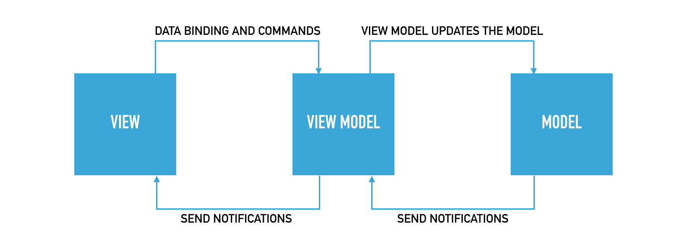
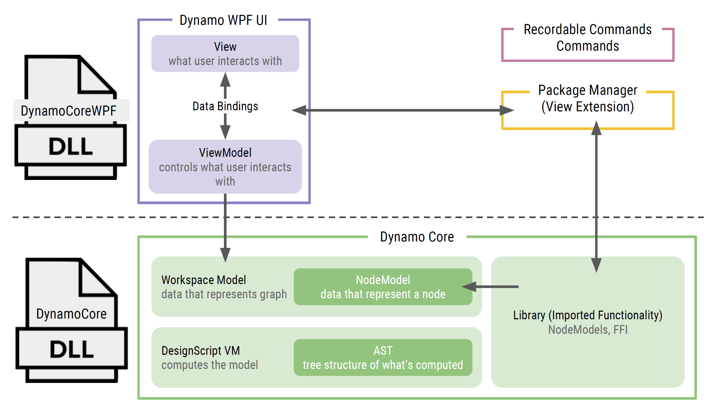

# 5.3 - WPF and MVVM <!-- omit in toc --> 

One of the most powerful reasons to wanting to create your own Extension/ViewExtension is to be able to add custom User Interfaces or UI on top of Dynamo. On this chapter we will briefly explain the **Model-View-ViewModel** UI design pattern and create an example of a WPF app.

- [MVVM](#mvvm)
  - [Model](#model)
  - [View](#view)
  - [View Model](#view-model)
- [Dynamo as MVVM](#dynamo-as-mvvm)
- [INotifyPropertyChanged and NotificationObject](#inotifypropertychanged-and-notificationobject)
- [Getting Started with WPF](#getting-started-with-wpf)

## MVVM
The Model-View-View-Model design pattern is similar to the well known MVC pattern in that the M (Model) and V (View) are relatively the same. The only difference resides between the C (Controller) and the VM (View Model).



### Model
Represents the Data + State + Business logic. It is not tied to the view nor to the controller, which makes it reusable in many contexts.

### View
Binds to observable variables and actions exposed by the View Model. It is possible for multiple views to bind to a single View Model.

### View Model
Responsible for wrapping the model and preparing observable data needed by the view. It also provides hooks for the view to pass events to the model. An important thing to keep in mind is that the View Model is not tied to the view.

## Dynamo as MVVM 
MVVM is a very common and widely use pattern across the UI development world, with similar variants on different platforms like MVC on web development. Dynamo itself makes use of this pattern internally.


## INotifyPropertyChanged and NotificationObject
The single most important element on WPF and MVVM development on .Net is the `INotifyPropertyChanged` interface. This interface is in charge of communicating between the **VieModel** and **View**, letting them know when something has change so they can be updated accordingly.

A minimum viable implementation of the `INotifyPropertyChanged` is shown below.
```csharp
public class MyViewModel : INotifyPropertyChanged
{

    #region PropertyChanged implementation
    public event PropertyChangedEventHandler PropertyChanged;
    protected virtual void OnPropertyChanged(string propertyName)
    {
        PropertyChangedEventHandler handler = PropertyChanged;
        if (handler != null) handler(this, new PropertyChangedEventArgs(propertyName));
    }
    #endregion

    // props
    private string name;
    public string Name
    {
        get { return this.name; }
        set 
        { 
            this.name = value;
            OnPropertyChanged(nameof(Name));
        }
    }
}
```

Dynamo provides an **abstract** class the encapsulates this logic called `NotificationObject`. By inheriting your `ViewModels`  classes from this abstract class, you make sure to have the notification logic implemented.
```csharp
namespace Dynamo.Core
{
    public abstract class NotificationObject : INotifyPropertyChanged
    {
        protected NotificationObject();

        public event PropertyChangedEventHandler PropertyChanged;

        protected virtual void RaisePropertyChanged(string propertyName);
        protected void RaisePropertyChanged(params string[] propertyNames);
    }
}
```

## Getting Started with WPF

Now we will jump to the [Getting Started with WPF](../04-ExplicitNodes/01-GettingStartedWithWPF.md) to learn the basics of Windows Presentation Foundation.