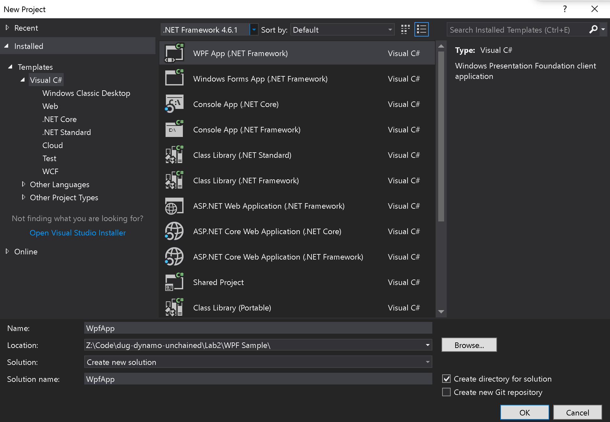
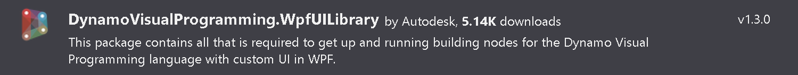
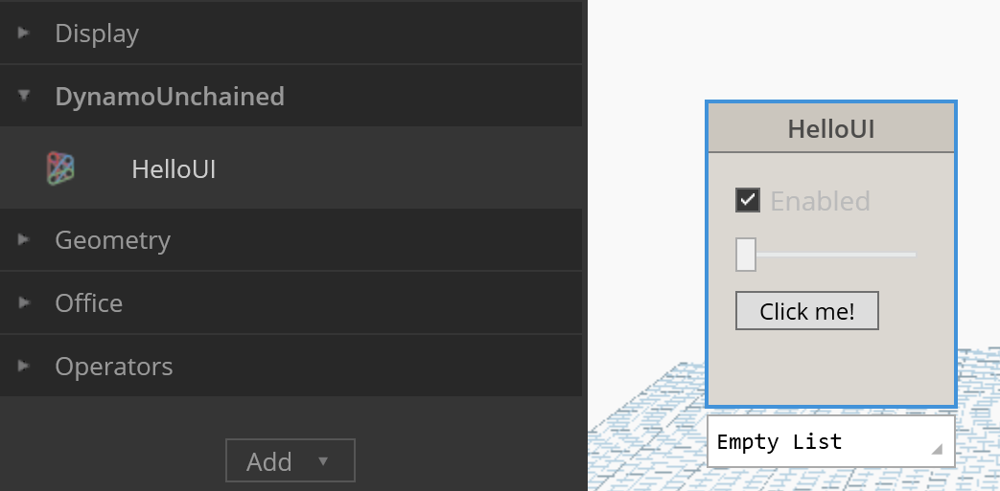
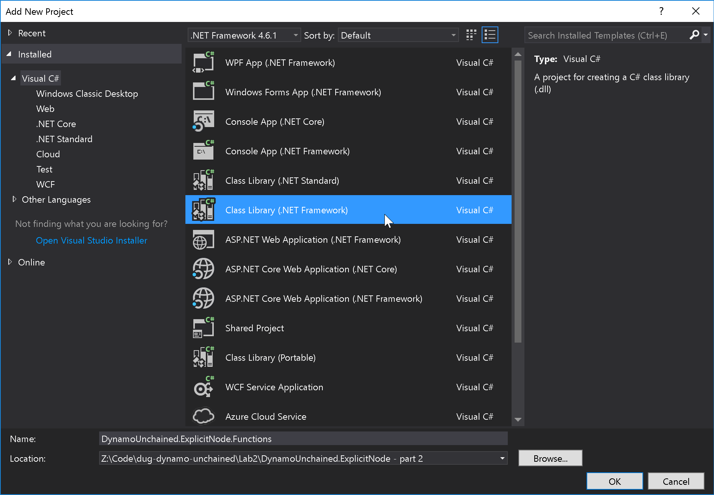

# AEC Hackathon Dynamo Workshop

Learn how to develop explicit Zero Touch Nodes in C#.

## Summary

This workshop will teach you how to set your graph free by developing explicit nodes with a custom UI. This approach is more advanced and complicated than the Zero Touch one, but nodes built this way have the most flexibility and power.

You will learn how to implement a custom UI, respond to other nodes and affect the state of the graph. You will also learn how to package your nodes and distribute them using the Dynamo Package Manager. 

The workshop be using Visual Studio and C#, an intermediate level of programming knowledge is needed, for additional information see the links in the [Additional Resources](https://github.com/radumg/AEC-hackathon-Dynamo-Workshop#Additional Resources) section.

## Table of Contents

[1 - Getting started with WPF](#1---Getting-started-with-WPF)
  - [Sample app](#Sample-app)
  - [WPF binding](#WPF-binding)
  - [User controls](#User-controls)
[2 - ExplicitNode Interfaces](#2---ExplicitNode-Interfaces)
  - [The NodeModel interface](#The-NodeModel-interface)
  - [The custom UI](#The-custom-UI)
  - [The INodeViewCustomization interface](#The-INodeViewCustomization-interface)
[3 - ExplicitNode Functions](#3---ExplicitNode-Functions)
  - [Executing functions](#Executing-functions)
  - [The BuildOutputAst method](#The-BuildOutputAst-method)
  - [Affecting the graph](#Affecting-the-graph)
[Publishing nodes to the Package Manager](#Publishing-nodes-to-the-Package-Manager)

## 1- Getting started with WPF

In the previous lab we have seen how to develop Zero Touch Nodes, which are great to add custom functionalities, but do not give us total control over the node's behaviour. In order to customize its UI, and to affect the state of the node and the graph an explicit custom node is needed. Explicit custom nodes are more complex and use Windows Presentation Foundation (WPF) a powerful framework for building Windows applications.

### Sample App

Let's first make a simple WPF application, to see how it works. Open Visual Studio and create a new WPF App project:



Now double click on MainWindow.xaml, expand the toolbox panel and add some UI controls as a slider, a checkbox and a button:


As you see VS has automatically created XAML tags corresponding to these UI elements, let's now edit it so that from these controls we can call methods in the C# code behind. We are going to add names to the controls, set `Grid.RowDefinitions` to better layout the controls, change a few properties and add a `Click` event to the button:

```xml
<Window x:Class="WpfApp.MainWindow"
        xmlns="http://schemas.microsoft.com/winfx/2006/xaml/presentation"
        xmlns:x="http://schemas.microsoft.com/winfx/2006/xaml"
        xmlns:d="http://schemas.microsoft.com/expression/blend/2008"
        xmlns:mc="http://schemas.openxmlformats.org/markup-compatibility/2006"
        xmlns:local="clr-namespace:WpfApp"
        mc:Ignorable="d"
        Title="MainWindow" SizeToContent="WidthAndHeight">
  <Grid Margin="10">
    <Grid.RowDefinitions>
      <RowDefinition Height="Auto"/>
      <RowDefinition Height="Auto"/>
      <RowDefinition Height="Auto"/>
    </Grid.RowDefinitions>
    <CheckBox Grid.Row="0" Margin="5" Name="EnabledCheckBox" Content="Enabled" HorizontalAlignment="Left" VerticalAlignment="Top"/>
    <Slider Grid.Row="1" Margin="5" Name="ValueSlider" HorizontalAlignment="Left"  VerticalAlignment="Top" Width="100"/>
    <Button Grid.Row="2" Margin="5" Click="Button_Click" Content="Click me!" HorizontalAlignment="Left"  VerticalAlignment="Top" Width="75"/>
  </Grid>
</Window>
```

Now in the code behind (MainWindow.cs) we can add the following function that will show up a 'MessageBox' with the slider value when the button is clicked:

```c#
private void Button_Click(object sender, RoutedEventArgs e)
{
  MessageBox.Show("Value is " + ValueSlider.Value);
}
```

Run the application and you'll see it working!


### WPF Binding

A very powerful feature of WPF is binding, it provides a simple and consistent way for applications to present and interact with data. Let's see what it means with a simple example, edit your button XAML code by adding `IsEnabled="{Binding ElementName=EnabledCheckBox, Path=IsChecked}"`, it will look like:

```xml
<Button
  Grid.Row="2"
  Width="75"
  Margin="5"
  HorizontalAlignment="Left"
  VerticalAlignment="Top"
  Click="Button_Click"
  Content="Click me!"
  IsEnabled="{Binding ElementName=EnabledCheckBox, Path=IsChecked}" />
```

If you run the app you'll see that as the checkbox is unchecked the button becomes disabled, we have bound the checkbox `IsChecked` property to the button status. Binding not only works between components, but also with the code behind.

### User Controls

Let's finally see how easy it is in WPF to create custom controls, right click on the project > Add > User Control and create a new one, I named mine `MyCustomControl.xaml`.


Now, from the XAML panel replace the content of `<Grid>...</Grid>` in `MyCustomControl.xaml` with the one in `MainWindow.xaml`. As do the same for our `Button_Click` function in `MainWindow.xaml.cs` and move it to `MyCustomControl.xaml.cs`.

We have now created a reusable custom control that we can embed inside other WPF controls. To add it to `MainWindow.xaml` we just need to save and add the `  xmlns:local="clr-namespace:WpfApp"` attribute to the `<Window>` element as below and a  `<local:MyCustomControl/>` XAML tag for this custom component inside the XAML `<Grid>` :


If you build and run the application you'll see it behaves exactly how it did before.

## 2 - ExplicitNode Interfaces

Let's now see how to use our User Control inside a custom UI node. Open the empty project inside `DynamoWorkshop.ExplicitNode - start`, this was set up in the same way we did in the previous lab, the only additional dependency, which can be installed via NuGet, is the WpfUILibrary:



### The NodeModel interface

Custom UI nodes implement the NodeModel **interface**, the same way native nodes do. An interface is like an abstract base class, any class that implements the interface must implement all its members. Basically you'll just have to add  `:NodeModel` after the class name, and have certain functions in your class.

Create a new class named `HelloUI.cs`, then add the interface, directives and attributes as below:

```c#
/* dynamo directives */
using Dynamo.Graph.Nodes;

namespace DynamoWorkshop.ExplicitNode
{
  [NodeName("HelloUI")]
  [NodeDescription("Sample Explicit Node")]
  [NodeCategory("Dynamo Unchained.Explicit Node")]
  [IsDesignScriptCompatible]
  public class HelloUI : NodeModel
  {
    public HelloUI()
    {

    }
  }
}

```

In explicit nodes there is no need for a `_DynamoCustomization.xml` file, as the attributes on top of our class will define its category, name & whether it's usable in code blocks.

### The Custom UI

We have already written a sample custom UI to implement in the sample WpfApp project, now we just need to copy `MyCustomControl.xaml` and `MyCustomControl.xaml.cs` to the current project folder and add them to the project, you can do this by dragging and dropping them:


You'll also need to replace the namespace in those two files, from `WpfApp` to `DynamoWorkshop.ExplicitNode`.

### The INodeViewCustomization Interface

Since our node has a custom UI, we need to create another class which implements the INodeViewCustomization interface. Create a new class named `HelloUINodeView.cs` and add:

```c#
/* dynamo directives */
using Dynamo.Controls;
using Dynamo.Wpf;

namespace DynamoWorkshop.ExplicitNode
{
  public class HelloUINodeView : INodeViewCustomization<HelloUI>
  {
    public void CustomizeView(HelloUI model, NodeView nodeView)
    {
      var ui = new MyCustomControl();
      nodeView.inputGrid.Children.Add(ui);
      ui.DataContext = model;
    }

    public void Dispose()
    {
    }
  }
}
```

The code above is assigning the custom view to the HelloUI NodeModel and binding the data.

If you debug, you'll see the node with the user control embedded, behaving as before, but without any input or output port. If you've missed any step you can find this completed part in the folder `DynamoWorkshop.ExplicitNode - part 1`.




## 3 - ExplicitNode Functions

In this final part we are going to add input and output ports to our node and interact with the graph. The following part is going to sound a bit confusing, but that's how Dynamo works in the background.

### Executing functions

NodeModels when executed run a method called `BuildOutputAst` this method takes your inputs and passes them to a function **which has to live in a separate assembly** (in our case a separate project). Let's create it:



Then let's add the `DynamoVisualProgramming.DynamoServices` NuGet package and a new static class named `Functions.cs`:

```c#
using Autodesk.DesignScript.Runtime;
namespace DynamoWorkshop.ExplicitNode.Functions
{
  [IsVisibleInDynamoLibrary(false)]
  public static class Functions
  {
    public static double MultiplyTwoNumbers(double a, double b)
    {
      return a * b;
    }
  }
}
```

### The BuildOutputAst method

Now we can implement `BuildOutputAst` inside of `HelloUI.cs`. First right click on the`DynamoWorkshop.ExplicitNode` project and add a reference to `DynamoWorkshop.ExplicitNode.Functions`.


Then edit HelloUI.cs:

```c#
using System;
using System.Collections.Generic;
/* dynamo directives */
using Dynamo.Graph.Nodes;
using ProtoCore.AST.AssociativeAST;

namespace DynamoWorkshop.ExplicitNode
{
  [NodeName("HelloUI")]
  [NodeDescription("Sample Explicit Node")]
  [NodeCategory("DynamoWorkshop")]
  [InPortNames("A")]
  [InPortTypes("double")]
  [InPortDescriptions("Number A")]
  [OutPortNames("Output")]
  [OutPortTypes("double")]
  [OutPortDescriptions("Product of two numbers")]
  [IsDesignScriptCompatible]
  public class HelloUI : NodeModel
  {
    public HelloUI()
    {
      RegisterAllPorts();
    }

    private double _sliderValue;

    public double SliderValue
    {
      get { return _sliderValue; }
      set
      {
        _sliderValue = value;
        RaisePropertyChanged("SliderValue");
        OnNodeModified(false);
      }
    }

    public override IEnumerable<AssociativeNode> BuildOutputAst(List<AssociativeNode> inputAstNodes)
    {
      if (!HasConnectedInput(0))
      {
        return new[] { AstFactory.BuildAssignment(GetAstIdentifierForOutputIndex(0), AstFactory.BuildNullNode()) };
      }
      var sliderValue = AstFactory.BuildDoubleNode(SliderValue);
      var functionCall =
        AstFactory.BuildFunctionCall(
          new Func<double, double, double>(Functions.Functions.MultiplyTwoNumbers),
          new List<AssociativeNode> { inputAstNodes[0], sliderValue });

      return new[] { AstFactory.BuildAssignment(GetAstIdentifierForOutputIndex(0), functionCall) };
    }
  }
}
```

And the slider in MyCustomControl.XAML to:

```xml
<Slider
  Name="ValueSlider"
  Grid.Row="1"
  Width="100"
  Margin="5"
  HorizontalAlignment="Left"
  VerticalAlignment="Top"
  IsSnapToTickEnabled="True"
  TickFrequency="1"
  Value="{Binding SliderValue}" />
```

And finally, we need to tell Dynamo to load `DynamoWorkshop.ExplicitNode.Functions.dll` as well, and that's done by editing `pkg.json` adding at the end:

```json
"node_libraries": [
    "DynamoWorkshop.ExplicitNode, Version=1.0.0.0, Culture=neutral, PublicKeyToken=null",
    "DynamoWorkshop.ExplicitNode.Functions, Version=1.0.0.0, Culture=neutral, PublicKeyToken=null"
  ]
```

You can now test your code and see how the input is multiplied by the value of the slider:


### Affecting the graph

You might have not noticed it, but with the current implementation the custom node is already affecting the graph. Every time the slider is moved its value changes, and it has a binding with the  `SliderValue` property in `HelloUI.cs` which then calls the `OnNodeModified()` method telling Dynamo that one of its nodes has changed and needs to be recomputed.

There is much more you can do with NodeModels as dynamically add or remove ports, affect their state, show warning/error messages etc...


## Publishing nodes to the Package Manager

Publishing a package to the package manager is a very simple process especially given how we have set up our Visual Studio projects. Only publish packages that you own and that you have tested thoroughly!

Publishing can only be done from Dynamo for Revit or Dynamo Studio, not from the Sandbox version.

Click on Packages > Manage Packages...


In the next screen make sure all the information is correct and that only the required dlls are being included (remember when we had to manually set `Copy Local` to `False` on the references?).

As you click Publish Online it will be on the Package Manager, to upload new version use `Publish Version...` instead.

Also note that packages cannot be deleted, but only deprecated.  


## Conclusion

We have seen the principles behind explicit custom nodes, and this workshop has given you the basis to get started with development. 

There are some technical challenges but also great benefits if you decide to build and use this type of custom node. WPF is a very powerful and widely useful framework, you'll be able to find lots of resources online and existing UI components to reuse. 

We have also seen how to publish your nodes online and contribute to the Dynamo community, if is a very straightforward process once you have set up your project correctly.

Happy coding!