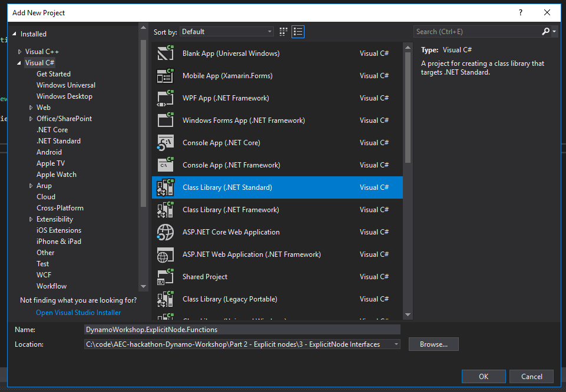
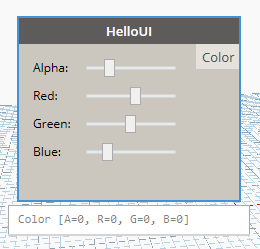

# 3 - Explicit Node Functions<!-- omit in toc --> 

In this final part we are going to add more bindings to the UI, add an output port, and have our node return something. 

- [More bindings](#more-bindings)
- [Executing functions](#executing-functions)
- [The BuildOutputAst method](#the-buildoutputast-method)
- [Expiring the node](#expiring-the-node)
- [Final touch](#final-touch)
- [Serializing / Deserializing nodes](#serializing--deserializing-nodes)

## More bindings

Add the following fields and properties to `HelloUI.cs`:

```csharp
    private int _sliderValueA;
    private int _sliderValueR;
    private int _sliderValueB;
    private int _sliderValueG;
    public int SliderValueA { get => _sliderValueA;  set { _sliderValueA = value; RaisePropertyChanged("SliderValueA"); }}
    public int SliderValueR { get => _sliderValueR;  set { _sliderValueR = value; RaisePropertyChanged("SliderValueR"); } }
    public int SliderValueB { get => _sliderValueB;  set { _sliderValueB = value; RaisePropertyChanged("SliderValueB"); }}
    public int SliderValueG { get => _sliderValueG;  set { _sliderValueG = value; RaisePropertyChanged("SliderValueG"); } }
```

If you debug your code now you'll see the binding to the UI sliders.

## Executing functions

NodeModels when executed run a method called `BuildOutputAst` this method takes your inputs and passes them to a function **which has to live in a separate assembly** (in our case a separate project). Let's create it:



Then let's add the `DynamoVisualProgramming.DynamoServices` NuGet package and the `System.Drawing ` reference.

Then create a new static class named `Functions.cs`:

```csharp
using Autodesk.DesignScript.Runtime;
using System.Drawing;

namespace DynamoWorkshop.ExplicitNode.Functions
{
  [IsVisibleInDynamoLibrary(false)]
  public static class Functions
  {
    public static DSCore.Color ColorByARGB(int a, int r, int g, int b)
    {
      return DSCore.Color.ByARGB(a, r, g, b);
    }
  }
}
```

## The BuildOutputAst method

Now we can implement `BuildOutputAst` inside of `HelloUI.cs`. First right click on the`DynamoWorkshop.ExplicitNode` project and add a reference to `DynamoWorkshop.ExplicitNode.Functions`.


Then add the `BuildOutputAst` function to HelloUI.cs:

```csharp
    public override IEnumerable<AssociativeNode> BuildOutputAst(List<AssociativeNode> inputAstNodes)
    {
      var sliderValueA = AstFactory.BuildDoubleNode(SliderValueA);
      var sliderValueR = AstFactory.BuildDoubleNode(SliderValueR);
      var sliderValueG = AstFactory.BuildDoubleNode(SliderValueG);
      var sliderValueB = AstFactory.BuildDoubleNode(SliderValueB);

      var functionCall =
        AstFactory.BuildFunctionCall(
          new Func<int, int, int, int, DSCore.Color>(Functions.Functions.ColorByARGB),
          new List<AssociativeNode> { sliderValueA, sliderValueR, sliderValueG, sliderValueB });

      return new[] { AstFactory.BuildAssignment(GetAstIdentifierForOutputIndex(0), functionCall) };
    }
```

And the `OutPort` attributes on the node:

```csharp
  [OutPortNames("Color")]
  [OutPortTypes("color")]
  [OutPortDescriptions("Selected Color")]
```

Your `HelloUI.cs` should look like this:

```csharp
using System;
using System.Collections.Generic;
using System.Linq;
/* dynamo directives */
using Dynamo.Graph.Nodes;
using Newtonsoft.Json;
using ProtoCore.AST.AssociativeAST;

namespace DynamoWorkshop.ExplicitNode
{
  [NodeName("HelloUI")]
  [NodeDescription("Sample Explicit Node")]
  [NodeCategory("DynamoWorkshop.Explicit Node")]
  [OutPortNames("Color")]
  [OutPortTypes("color")]
  [OutPortDescriptions("Selected Color")]
  [IsDesignScriptCompatible]
  public class HelloUI : NodeModel
  {
    //Json Constructor for Dynamo 2.0 nodes
    [JsonConstructor]
    private HelloUI(IEnumerable<PortModel> inPorts, IEnumerable<PortModel> outPorts) : base(inPorts, outPorts)
    {
    }

    public HelloUI()
    {
      RegisterAllPorts();
    }

    private int _sliderValueA;
    private int _sliderValueR;
    private int _sliderValueB;
    private int _sliderValueG;
    public int SliderValueA { get => _sliderValueA;  set { _sliderValueA = value; RaisePropertyChanged("SliderValueA"); }}
    public int SliderValueR { get => _sliderValueR;  set { _sliderValueR = value; RaisePropertyChanged("SliderValueR"); } }
    public int SliderValueB { get => _sliderValueB;  set { _sliderValueB = value; RaisePropertyChanged("SliderValueB"); }}
    public int SliderValueG { get => _sliderValueG;  set { _sliderValueG = value; RaisePropertyChanged("SliderValueG"); } }

    public override IEnumerable<AssociativeNode> BuildOutputAst(List<AssociativeNode> inputAstNodes)
    {
      var sliderValueA = AstFactory.BuildDoubleNode(SliderValueA);
      var sliderValueR = AstFactory.BuildDoubleNode(SliderValueR);
      var sliderValueG = AstFactory.BuildDoubleNode(SliderValueG);
      var sliderValueB = AstFactory.BuildDoubleNode(SliderValueB);

      var functionCall =
        AstFactory.BuildFunctionCall(
          new Func<int, int, int, int, DSCore.Color>(Functions.Functions.ColorByARGB),
          new List<AssociativeNode> { sliderValueA, sliderValueR, sliderValueG, sliderValueB });

      return new[] { AstFactory.BuildAssignment(GetAstIdentifierForOutputIndex(0), functionCall) };
    }
  }
}
```

And finally, we need to tell Dynamo to load `DynamoWorkshop.ExplicitNode.Functions.dll` as well, and that's done by editing `pkg.json` adding at the end:

```json
"node_libraries": [
    "DynamoWorkshop.ExplicitNode, Version=1.0.0.0, Culture=neutral, PublicKeyToken=null",
    "DynamoWorkshop.ExplicitNode.Functions, Version=1.0.0.0, Culture=neutral, PublicKeyToken=null"
  ]
```

If we test the code we can see the OutPort, but it's not changing when the sliders change. We need to Expire the node for it to happen!



## Expiring the node

Fortunately enough, expiring the node is easy. Just call `OnNodeModified()` to do so. In our case we'll add that to the setter methods of each or our SliderValues:

```csharp
    public int SliderValueA { get => _sliderValueA;  set { _sliderValueA = value; RaisePropertyChanged("SliderValueA"); OnNodeModified(); }}
    public int SliderValueR { get => _sliderValueR;  set { _sliderValueR = value; RaisePropertyChanged("SliderValueR"); OnNodeModified(); } }
    public int SliderValueB { get => _sliderValueB;  set { _sliderValueB = value; RaisePropertyChanged("SliderValueB"); OnNodeModified(); } }
    public int SliderValueG { get => _sliderValueG;  set { _sliderValueG = value; RaisePropertyChanged("SliderValueG"); OnNodeModified(); } }
```

It could be cleaner, but it'll work for now.

## Final touch

As a final touch, let's preview the color generated by the sliders in the Node UI. This can be done with `INodeViewCustomization` as it gives us access to the Dynamo `NodeView`, the class that defines the nodes default appearance.

In `HelloUINodeView.cs`, add references to namespaces `System.Windows.Media` and `System.Windows.Shapes`. Then, add to `CustomizeView` method the following event handlers to track when the sliders are moved.


```csharp
      using System.Windows.Media;
      using System.Windows.Shapes;
```

```csharp
      ui.SliderA.ValueChanged += Slider_ValueChanged;
      ui.SliderR.ValueChanged += Slider_ValueChanged;
      ui.SliderG.ValueChanged += Slider_ValueChanged;
      ui.SliderB.ValueChanged += Slider_ValueChanged;
```

and then add the following method:

```csharp
private void Slider_ValueChanged(object sender, System.Windows.RoutedPropertyChangedEventArgs<double> e)
{

  ((Rectangle)_nodeview.grid.FindName("nodeBackground")).Fill = new SolidColorBrush(Color.FromArgb(
                                                Convert.ToByte(_model.SliderValueA), 
                                                Convert.ToByte(_model.SliderValueR),
                                                Convert.ToByte(_model.SliderValueG), 
                                                Convert.ToByte(_model.SliderValueB)));
}
```
The node background color will now change accordingly.


## Serializing / Deserializing nodes

If you save the custom node in a definition and load it again you will see that the sliders value persisted, that's because it's being serialized with the node.

Dynamo 2.0 makes it very easy to serialize / deserialize variables on custom nodes. To do that, a variable needs to be `public`, and it will be automatically saved and loaded.

To ignore a property or a field, use the `[JsonIgnore]` attribute and it'll be skipped.


